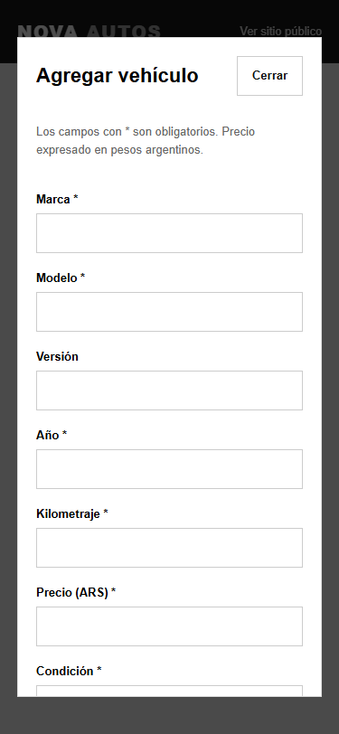

## Portfolio Project

NOVA AUTOS is a responsive dealership website and management system built as a portfolio project.

It demonstrates my ability to build complete business websites with:
- Responsive design
- Authentication
- Database integration
- Image storage
- Admin dashboards
- Mobile support
- Secure data access with RLS

  
# NOVA AUTOS

Proyecto de portfolio que simula una agencia multimarca, con catálogo público y panel privado para administrar vehículos y fotografías. Implementado con HTML, CSS y JavaScript nativo; Supabase aporta PostgreSQL, Auth y Storage. No utiliza frameworks ni requiere un servidor de aplicación.

Los vehículos, precios y contactos se presentan como datos de demostración. No representa una agencia comercial ni procesa compras o financiación.

## Funcionalidades principales

- Catálogo responsive y fichas individuales con galería y consultas por WhatsApp.
- Inicio de sesión y permisos administrativos mediante Supabase Auth y RLS.
- Alta, edición, eliminación y estados de vehículos.
- Carga de múltiples fotos, selección de principal y limpieza de archivos pendientes.
- Migración del stock inicial y validación de datos e imágenes.

## Vista previa

Capturas de la versión de demostración y del formulario administrativo en móvil:

| Catálogo público | Formulario administrativo |
| --- | --- |
|  |  |

## Inicio rápido — demo sin cuenta

Con Node.js 22 o posterior:

```sh
git clone https://github.com/juanferreyra-dev/nova-autos.git
cd nova-autos
cp supabase-config.example.js supabase-config.js
node serve.mjs
```

En PowerShell, también podés copiar la configuración con `Copy-Item supabase-config.example.js supabase-config.js`.

Abrí `http://localhost:4173`. Con las claves vacías se muestra el catálogo original. Para usar el panel, configurá tu propio proyecto Supabase siguiendo las instrucciones de abajo. No hay una contraseña pública ni una cuenta administrativa compartida.

## Estado de la integración

La integración con Supabase está implementada. El repositorio incluye `supabase-config.example.js` con valores vacíos; la configuración local `supabase-config.js` se excluye de Git para que cada instalación utilice su propio proyecto. Hasta configurarla, la portada conserva los seis vehículos originales y sus fotos, identificados como stock de demostración.

Al completar ambas credenciales, el catálogo pasa a consultar exclusivamente Supabase. Si no hay vehículos muestra un estado vacío; si falla la conexión muestra un mensaje. No vuelve al stock anterior durante un error, para evitar ofrecer vehículos eliminados o vendidos.

Los vehículos vendidos quedan fuera del stock principal. Su URL individual sigue accesible y muestra **VENDIDO**, permitiendo consultar alternativas. Los reservados permanecen visibles con su etiqueta. El catálogo se actualiza al abrir o recargar la página; no necesita modificar HTML ni volver a desplegar para publicar un auto. No incorpora actualización en tiempo real de pestañas ya abiertas.

## Archivos

| Archivo o carpeta | Responsabilidad |
| --- | --- |
| `index.html`, `style.css`, `script.js` | Diseño público original, menú móvil y catálogo dinámico |
| `login.html`, `login.js` | Inicio de sesión por email y contraseña, sin registro público |
| `admin.html`, `admin.js`, `admin.css` | Panel, estados, eliminación y estilos responsive |
| `vehiculo.html`, `vehiculo.js` | Ficha individual, galería y WhatsApp contextual |
| `supabase-config.js` | URL de Supabase, clave pública y número placeholder de WhatsApp |
| `supabase-config.example.js` | Plantilla versionada para crear la configuración local |
| `js/supabase-client.js` | Carga del SDK oficial, versión fijada a 2.57.4 desde jsDelivr |
| `js/auth.js` | Verificación de sesión y autorización administrativa |
| `js/vehicles.js` | Consultas, publicación y limpieza de Storage |
| `js/vehicle-editor.js` | Formulario, validación, previews y selección de principal |
| `js/legacy-import.js` | Migración revisada de los vehículos originales |
| `js/ui.js` | Formatos, mensajes y componentes compartidos |
| `supabase/schema.sql` | Tablas, índices, funciones, permisos, RLS y bucket |
| `supabase/legacy-stock.json` | Datos conocidos del stock anterior; no inventa los faltantes |
| `img/` | Fotografías originales conservadas y placeholder para imágenes faltantes |
| `serve.mjs` | Servidor estático local sin dependencias |
| `build.mjs`, `_headers` | Preparación de archivos y cabeceras para Cloudflare Pages |
| `tests/` | Pruebas de navegador y PostgreSQL con servicios simulados |

## Configurar Supabase

### 1. Crear el proyecto

Crear un proyecto en el Dashboard de Supabase y esperar que la base de datos esté disponible. La contraseña de PostgreSQL se utiliza para administración del proyecto, **nunca se coloca en esta web**.

En Authentication, mantener habilitado el proveedor Email y desactivar la opción que permite registrar nuevos usuarios (**Allow new users to sign up**). No habilitar acceso anónimo. Configurar Site URL con el dominio definitivo y las URLs locales necesarias en URL Configuration. La aplicación usa inicio de sesión con contraseña; no contiene formularios de registro ni recuperación. Las cuentas y los cambios de contraseña se gestionan de forma controlada en Supabase.

### 2. Ejecutar el SQL

Abrir SQL Editor, pegar todo `supabase/schema.sql` y ejecutar **una vez en un proyecto nuevo**. El archivo usa una transacción: un error evita dejar una instalación incompleta. No está diseñado para sobrescribir un esquema existente; si ya hay tablas con esos nombres, revisar la instalación antes de ejecutar.

El SQL crea:

- `vehicles`, `vehicle_images` y su relación con eliminación en cascada.
- `admin_users`, una lista explícita de usuarios autorizados sin acceso desde el frontend.
- `storage_cleanup`, una cola privada de archivos pendientes de limpieza.
- `is_admin()` y `save_vehicle()`, más triggers para fechas y limpieza.
- RLS en todas las tablas públicas, permisos mínimos y políticas por operación.
- El bucket público `vehicle-photos`, limitado a JPG, PNG y WebP de hasta 5 MB, y sus políticas.

No hay que crear el bucket manualmente antes de ejecutar el archivo. Comprobar luego su presencia en Storage. El bucket es público porque contiene fotografías del catálogo: no subir documentos privados, identificaciones ni información de clientes. La lectura de fotos públicas no requiere login; subir y eliminar sí requiere un administrador autorizado. Se impide eliminar un archivo todavía referenciado por un vehículo.

### 3. Crear el primer administrador

En **Authentication → Users → Add user / Create new user**, crear la cuenta de forma controlada, con email y una contraseña segura. Confirmar el email desde ese flujo administrativo cuando corresponda. Copiar el **User UID** que muestra Supabase.

En SQL Editor, reemplazar el marcador y ejecutar:

```sql
insert into public.admin_users (user_id)
values ('REEMPLAZAR_POR_EL_UUID_DEL_USUARIO'::uuid)
on conflict (user_id) do nothing;
```

Crear una cuenta en Auth no le da automáticamente permisos de administración. La tabla `admin_users` debe contener su UUID. La aplicación no usa `user_metadata` ni permite que una cuenta se autorice a sí misma.

Para revocar acceso administrativo, eliminar ese UUID de `admin_users` desde SQL Editor. Las políticas consultan esa tabla en cada operación, incluso si el usuario todavía tiene una sesión abierta.

### 4. Copiar sólo los valores públicos

En el Dashboard, usar el diálogo **Connect** o **Project Settings → API / API Keys** para obtener:

| Valor del proyecto | Constante en `supabase-config.js` |
| --- | --- |
| Project URL, con formato `https://…supabase.co` | `SUPABASE_URL` |
| Publishable key, prefijo `sb_publishable_…`, o clave legacy `anon` | `SUPABASE_ANON_KEY` |

Pegar cada valor entre las comillas vacías y guardar el archivo. El nombre `SUPABASE_ANON_KEY` admite tanto la clave pública moderna como la legacy. Ambas están destinadas al navegador; el acceso real queda restringido mediante RLS y la sesión. No usar `service_role`, `sb_secret_…` ni la contraseña de PostgreSQL. [Documentación oficial de claves](https://supabase.com/docs/guides/api/api-keys).

Las variables del panel de Cloudflare no reemplazan automáticamente constantes de un archivo JavaScript estático. En esta implementación se completa `supabase-config.js` antes de generar o publicar el sitio.

## Ejecutar localmente

Instalar Node.js 22 o posterior. Desde la carpeta del proyecto:

```sh
node serve.mjs
```

Abrir `http://localhost:4173` y acceder al panel desde `http://localhost:4173/login.html`. No abrir con doble clic / `file://`: los módulos y la carga de datos requieren HTTP. El servidor local se limita a `127.0.0.1`.

Para un teléfono físico, publicar una vista previa HTTPS y abrirla desde el teléfono. La carga de imágenes usa APIs del navegador y UUIDs seguros; usar HTTPS en producción. Se necesita acceso a jsDelivr y al proyecto Supabase.

## Migrar los seis vehículos existentes

1. Configurar primero Supabase en una copia local o vista previa; mantener la publicación actual mientras se prepara el stock.
2. Iniciar sesión, abrir **Migrar vehículos de la web anterior**, elegir un vehículo y pulsar **Preparar vehículo**.
3. Revisar precio, estado y datos originales. Completar condición, combustible, transmisión o kilómetros que falten. No se dedujeron esos datos de las fotografías.
4. Confirmar la foto y pulsar **Publicar vehículo**. Repetir para los vehículos que correspondan.
5. Comprobar las fichas y recién entonces publicar la versión conectada.

Los UUIDs del importador son estables: seleccionar un auto ya migrado abre su edición. Un auto eliminado puede importarse otra vez sólo mediante esta acción explícita. Las fotografías originales permanecen en `img/`. Dos archivos antiguos tienen contenido AVIF/WebP aunque su extensión sea `.jpg`; el importador genera una copia JPEG para Storage sin modificar los originales.

## Operación diaria

- **Agregar vehículo** abre el formulario completo; se requieren marca, modelo, año, kilómetros, precio, condición, combustible, transmisión, ubicación, estado y al menos una foto. Color, puertas, motor, versión y descripción son opcionales.
- Se aceptan de 1 a 10 fotos JPG, PNG o WebP, de hasta 5 MB por archivo. El navegador también comprueba que se puedan decodificar y limita a 40 megapíxeles. No se admiten SVG ni documentos.
- Las nuevas fotos se muestran antes de subir. **Usar como principal** coloca una foto primero; **Quitar foto** prepara su eliminación. Los cambios se aplican al guardar.
- **Editar** permite modificar todos los datos. Los controles quedan bloqueados durante el guardado para evitar envíos repetidos.
- Los botones de estado cambian entre disponible, reservado y vendido. `updated_at` se actualiza en la base.
- **Eliminar** pide confirmación dentro del panel, elimina el vehículo y sus registros de fotos e intenta borrar sus objetos de Storage.
- **Cerrar sesión** termina el acceso desde el dispositivo. Una sesión inválida redirige al login.

El precio se expresa en pesos argentinos (ARS). Los enlaces de consulta incluyen marca, modelo, versión y año, y conservan el número placeholder `5492640000000`. Cambiar ese número también en los enlaces generales existentes de `index.html` y `vehiculo.html` cuando se defina el número real.

### Consistencia de datos y fotografías

`save_vehicle()` guarda el vehículo y sus referencias de fotos en una transacción de PostgreSQL, después de subir los archivos. Una edición usa `updated_at` para detectar cambios en otra sesión; no sobrescribe silenciosamente una edición posterior.

Storage no comparte una transacción con PostgreSQL. Cada archivo nuevo se registra antes de subir en una cola de limpieza con espera de 24 horas. Al guardar correctamente, se retiran de la cola los archivos asociados. Las fotos quitadas y las de vehículos eliminados quedan pendientes para limpieza inmediata. El panel procesa hasta 100 entradas por ingreso o guardado/eliminación; si falla, las conserva para un próximo intento.

Si se cierra la pestaña durante una subida, los archivos huérfanos se podrán limpiar al ingresar después de esas 24 horas. No hay tarea programada: si nadie vuelve a abrir el panel, la limpieza pendiente espera. Ante un corte de red durante el guardado, recargar y comprobar el listado antes de repetir: la base podría haber confirmado la operación aunque no llegara la respuesta al navegador.

## Seguridad

La URL `admin.html` sigue siendo un archivo estático público; sus datos y operaciones están protegidos por Auth y RLS. Ocultar un enlace o redirigir el navegador no reemplaza esa seguridad. Las políticas permiten lectura pública y escrituras sólo a usuarios presentes en `admin_users`. También se revocan privilegios amplios heredados, incluido `TRUNCATE`, que no está protegido por RLS.

El frontend no almacena contraseñas. Supabase Auth administra la sesión y sus tokens; el SDK puede mantener la sesión en el navegador. Los textos del catálogo se insertan como texto, no como HTML ejecutable. Las rutas de Storage usan UUIDs, sin reutilizar nombres suministrados por el usuario.

No subir a GitHub: contraseñas, claves secretas/service-role, tokens de acceso, archivos `.env` con secretos, backups de usuarios ni datos personales. La URL y la clave pública pueden estar en el frontend siempre que el SQL de permisos esté instalado. [Políticas de Storage](https://supabase.com/docs/guides/storage/security/access-control) y [autenticación por contraseña](https://supabase.com/docs/reference/javascript/auth-signinwithpassword).

## Publicar en Cloudflare Pages

No se realizó ningún despliegue ni se creó infraestructura externa como parte de esta implementación.

1. Configurar Supabase, probar el stock y completar las constantes públicas.
2. Subir el proyecto a un repositorio, excluyendo los archivos indicados en `.gitignore`.
3. En Cloudflare, crear un proyecto **Pages** conectado al repositorio.
4. Elegir framework **None**, directorio raíz del repositorio, comando de build **`node build.mjs`** y directorio de salida **`dist`**.
5. Publicar y actualizar Site URL / URLs autorizadas en Supabase con el dominio HTTPS definitivo.

`build.mjs` copia únicamente los recursos públicos, incluido el JSON del stock anterior. No copia SQL, pruebas, README ni herramientas locales. No instala dependencias ni agrega frameworks. Las cabeceras de `_headers` evitan el embedding en iframes y limitan capacidades innecesarias del navegador.

También se puede ejecutar `node build.mjs` localmente y cargar `dist/` mediante Direct Upload. No configurar una redirección global a `index.html`: es un sitio de múltiples páginas HTML. [Guía oficial de sitios HTML en Pages](https://developers.cloudflare.com/pages/framework-guides/deploy-anything/).

## Verificación

Se ejecutaron **20 escenarios de navegador** con Supabase simulado y **10 comprobaciones SQL** en PostgreSQL embebido con roles y RLS reales pero tablas Auth/Storage simuladas. Se revisaron capturas de móvil y escritorio y se comprobaron anchos entre 320 y 1440 px sin desbordes horizontales. Esto comprueba lógica y permisos SQL; **no reemplaza la prueba de integración contra el proyecto Supabase real**.

Para repetirlas con npm disponible:

```sh
npm install --prefix .test-tools --no-save playwright @electric-sql/pglite@0.3.14
npx --prefix .test-tools playwright install chromium
node tests/schema.test.mjs
node tests/browser.test.mjs
```

Las herramientas de prueba no se utilizan en producción. También se puede definir `BROWSER_CHANNEL=msedge` para usar Edge instalado, o `PLAYWRIGHT_PATH` / `PGLITE_PATH` para módulos disponibles en otra ubicación. Las capturas quedan en `test-results/`, excluidas de Git.

### Validación manual antes de publicar

- Con credenciales configuradas, abrir el catálogo en una ventana privada y comprobar lectura pública.
- Intentar entrar a `admin.html` sin sesión: debe redirigir al login.
- Crear una cuenta de prueba que no figure en `admin_users`: no debe acceder al panel ni modificar tablas/fotos por la API. No activar registro público para esta prueba.
- Con el administrador, publicar un vehículo ficticio con varias imágenes y verificarlo en una segunda ventana pública.
- Editar precio, kilómetros, campos técnicos y descripción; agregar/quitar fotos y cambiar la principal.
- Marcar reservado, vendido y disponible; comprobar catálogo y ficha en cada estado.
- Cancelar una eliminación y comprobar que conserva el vehículo. Confirmarla después y verificar tablas y objetos del bucket.
- Probar un archivo inválido, uno mayor a 5 MB, más de 10 fotos y un fallo de red durante la carga. Comprobar mensajes y reintentos de limpieza.
- Expirar/cerrar la sesión, revocar autorización y confirmar que las escrituras dejan de estar permitidas.
- Abrir fichas inexistentes y verificar el mensaje de WhatsApp con el vehículo correcto.
- Revisar portada, menú, formulario, previews y galería en teléfono, tablet y escritorio.

Sin crear/configurar Supabase no pueden funcionar el login real, las escrituras, las fotografías remotas ni las fichas dinámicas. La portada de demostración continúa disponible hasta completar ambas constantes.
